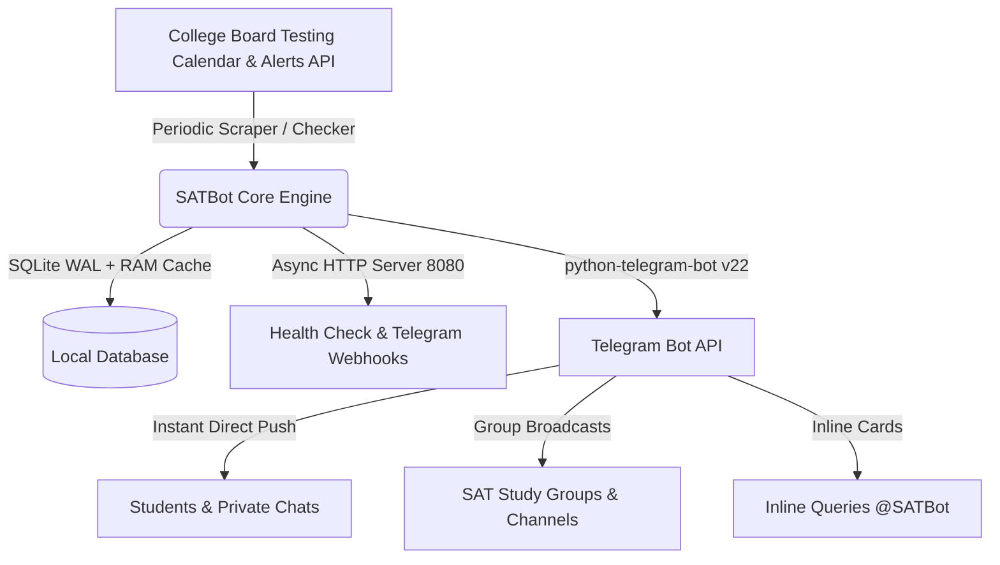

<div align="center">

# 🎓 SATBot — Official SAT Score Release & Exam Tracker

**An intelligent, high-performance Telegram Bot for Digital SAT students and study groups.**  
*Automated College Board score drop notifications, live exam countdowns, test-day checklists, and timezone conversion.*

[](https://github.com/topuniuz/SATBot/actions)
[](https://www.python.org/)
[](LICENSE)
[](https://core.telegram.org/bots/api)
[](https://github.com/psf/black)

[Features](#-key-features) • [Quick Start](#-quick-start) • [Deployment](#-free-247-hosting-on-render) • [Commands](#-commands-reference) • [Contributing](#-contributing) • [License](#-license)

</div>

---

## ✨ Key Features

- 📢 **Official Score Release Alerts**: Automatically notifies students the second College Board releases SAT scores across morning (~6:00 AM ET) and evening (~6:00 PM ET) rolling batches.
- ⚡ **Early Release Detection**: Live scanner monitors College Board's official API alert feeds to broadcast instant early-release notifications.
- ⏳ **Live Countdowns**: Real-time days, hours, and date countdowns to the next Digital SAT exam and score drop.
- 🎒 **Test-Day Checklists & Motivation**:
  - **7 Days Before**: Bluebook™ setup and admission ticket verification.
  - **1 Day Before**: Packing list (photo ID, approved calculator, device charger, snacks) and rest guidelines.
  - **Exam Morning**: Motivational good-luck messages and test-center door closing times.
- 🌍 **Dynamic Timezone Engine**: Automatically converts all testing schedules and countdowns to the student's local timezone (e.g., `Asia/Tashkent`, `US/Eastern`, `Europe/London`, `UTC`).
- 👥 **Telegram Groups & Supergroups**: Add `@SATBot` to any classroom or study group chat for automated group reminders and shared countdowns.
- 🔍 **Inline Mode Anywhere**: Type `@SATBot` in any Telegram chat to instantly generate and share live interactive SAT countdown and schedule cards.
- 👑 **Interactive Admin Control Panel**: Visual 1-tap broadcast engine with live previews, subscriber database metrics, and alert template testing.
- ⚡ **Zero Downtime & Fast Engine**: SQLite in **WAL mode** with in-memory caching and built-in HTTP server supporting both Webhook and Polling.

---

## 📱 Bot Commands Reference

### 🎓 Student & Group Commands
| Command | Description |
| :--- | :--- |
| `/start` | Open the interactive main dashboard and subscribe to alerts |
| `/schedule` | View official 2026–2028 College Board SAT test & score dates |
| `/countdown` | Live real-time countdown to the next SAT and score release |
| `/timezone` | Select or set your city/region timezone |
| `/tips` | Digital SAT test-day checklist and pacing strategies |
| `/status` | View notification status and toggle alert preferences |
| `/contact` | Send a support message or feedback directly to the maintainers |

### 👑 Admin Control Commands
| Command | Description |
| :--- | :--- |
| `/admin` | Open the visual interactive Admin Control Panel |
| `/broadcast <msg>` | Broadcast custom formatted announcement to all subscribers |
| `/announce_scores` | Instantly trigger score release broadcast for the current SAT |
| `/reply <user_id> <msg>` | Reply directly to a student's support message |
| `/stats` | View real-time active and registered subscriber counts |

---

## 🛠 Tech Stack & Architecture



- **Runtime**: Python 3.11+ (Asynchronous `asyncio`)
- **Framework**: `python-telegram-bot` 22.8+
- **Database**: SQLite3 with `WAL` (Write-Ahead Logging) mode and in-memory cache
- **Server**: Zero-dependency async HTTP server for webhooks and health monitoring
- **Hosting Compatibility**: Render, Railway, Fly.io, Docker, AWS, VPS

---

## 💻 Local Development Setup

### 1. Clone the Repository
```bash
git clone https://github.com/topuniuz/SATBot.git
cd SATBot
```

### 2. Create Virtual Environment & Install Dependencies
```bash
python3 -m venv venv
source venv/bin/activate  # On Windows: venv\Scripts\activate
pip install -r requirements.txt
```

### 3. Environment Configuration
```bash
cp .env.example .env
```
Edit `.env` with your credentials:
```env
BOT_TOKEN=your_telegram_bot_token_here
ADMIN_USER_ID=your_numeric_telegram_user_id
ADMIN_CONTACT=@mx767
PORT=8080
TIMEZONE=Asia/Tashkent
```

### 4. Run the Test Suite
```bash
python3 test_bot.py
```

### 5. Launch the Bot
```bash
python3 bot.py
```

---

## 🌐 Free 24/7 Hosting on Render

You can host SATBot **100% free** with 24/7 uptime on [Render.com](https://render.com):

1. **Push to GitHub**: Fork or push this repo to your GitHub account.
2. **Create Web Service on Render**:
   - Go to [dashboard.render.com](https://dashboard.render.com) ➔ **New +** ➔ **Web Service**.
   - Connect your `SATBot` repository.
   - **Environment**: `Python 3`
   - **Build Command**: `pip install -r requirements.txt`
   - **Start Command**: `python bot.py`
   - **Instance Type**: `Free`
3. **Set Environment Variables**:
   - `BOT_TOKEN`: Token from [@BotFather](https://t.me/BotFather)
   - `ADMIN_USER_ID`: Your numeric Telegram ID from [@userinfobot](https://t.me/userinfobot)
   - `ADMIN_CONTACT`: `@your_telegram_username`
   - `PORT`: `8080`
4. **Keep-Alive (Prevent Free Instance Sleep)**:
   - Copy your Render service URL (e.g. `https://satbot-mne0.onrender.com`).
   - Add a free 5-minute HTTP monitor on [cron-job.org](https://cron-job.org) or [uptimerobot.com](https://uptimerobot.com) targeting `https://satbot-mne0.onrender.com/health`.
   - Your bot will stay awake 24/7 with zero spin-down delay!

---

## 🤝 Contributing

Contributions make the open-source community an amazing place to learn, inspire, and create. Any contributions you make are **greatly appreciated**.

Please see [CONTRIBUTING.md](CONTRIBUTING.md) for details on code style, testing, and pull request workflows.

---

## 🛡 Security

If you discover any security vulnerabilities, please review our [SECURITY.md](SECURITY.md) for reporting guidelines.

---

## 📄 License

Distributed under the **MIT License**. See [LICENSE](LICENSE) for more information.

---

<div align="center">
  <sub>Built with ❤️ for SAT students worldwide by <a href="https://github.com/topuniuz">topuniuz</a>.</sub>
</div>
